# LBAM_inpainting

## Introduction
This is the pytorch implementation of Paper: Image Inpainting With Learnable Bidirectional Attention Maps (ICCV 2019) [paper](http://openaccess.thecvf.com/content_ICCV_2019/papers/Xie_Image_Inpainting_With_Learnable_Bidirectional_Attention_Maps_ICCV_2019_paper.pdf) [suppl](http://openaccess.thecvf.com/content_ICCV_2019/supplemental/Xie_Image_Inpainting_With_ICCV_2019_supplemental.pdf)

### Model Architecture
We propose a Bidirectional Attention model based on the [U-Net](https://arxiv.org/pdf/1611.07004.pdf) architecture.
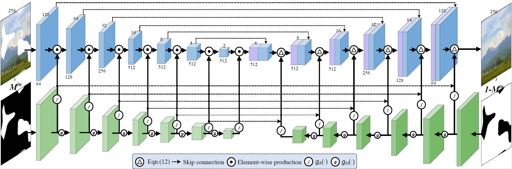

### Bidrectional Attention Layer
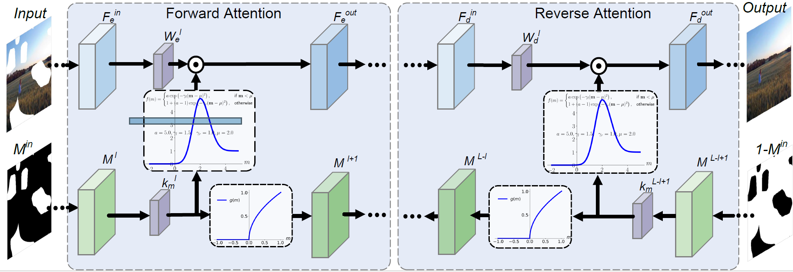

## Prerequisites
- Python 3.6
- Pytorch >= 1.0 (tested on pytorch version 1.0.0, 1.2.0, 1.3.0)
- CPU or NVIDIA GPU + Cuda + Cudnn

### Training
To train the LBAM model:
```bash
python train.py --batchSize numOf_batch_size --dataRoot your_image_path \
--maskRoot your_mask_root --modelsSavePath path_to_save_your_model \
--logPath path_to_save_tensorboard_log --pretrain(optional) pretrained_model_path
```

### Testing
To test the model:
```bash
python test.py --input input_image --mask your_mask --output output_file_prefix --pretrain pretrained_model_path
```

To test with random batch with random masks:
```
python test_random_batch.py --dataRoot your_image_path
--maskRoot your_mask_path --batchSize numOf_batch_size --pretrain pretrained_model_path
```

### Some Results
We suggest that you train our model with a large batch size (>= 48 or so). We re-train our model with batch size 10, the results degrades a little bit, I guess it may be due to the batch-normalization opreation (I would try removing bn from LBAM and see how it affects).

The pretrained model can be found at [google drive](https://drive.google.com/drive/folders/17DJEp0APDcZoWPIHwMFs78ak59pYlDPw), or [baidu cloud](https://pan.baidu.com/share/init?surl=z9hNEpbhsK2r-TEJbYkuQw) with extract code: mvzh. I made a slight change by setting the bn to false and modify the last tanh from absolute value to (tanh() + 1) / 2.

Here are some inpainting results that we train with batch size of 10 on Paris StreetView dataset:
<table style='float:center'>
 <tr>
  <th><B>Input</B></th> <th><B>Results</B></th> <th><B>Ground-Truth</B></th>
 </tr>

<tr>
    <td>
     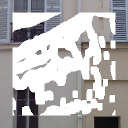
    </td>
    <td>
     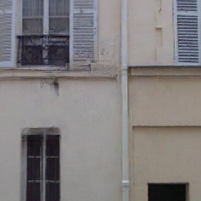
    </td>
    <td>
     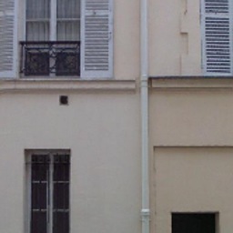
    </td>

</tr>

<tr>
    <td>
     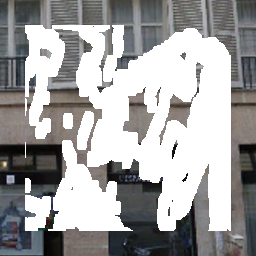
    </td>
    <td>
     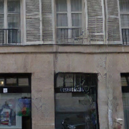
    </td>
    <td>
     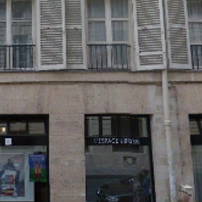
    </td>

</tr>

<tr>
    <td>
     
    </td>
    <td>
     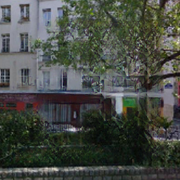
    </td>
    <td>
     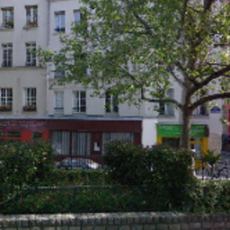
    </td>

</tr>

<tr>
    <td>
     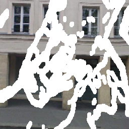
    </td>
    <td>
     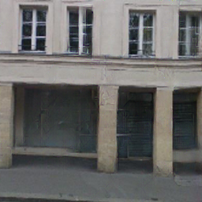
    </td>
    <td>
     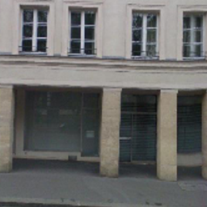
    </td>

</tr>

<tr>
    <td>
     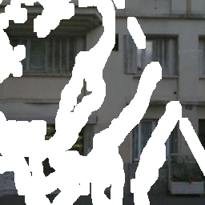
    </td>
    <td>
     
    </td>
    <td>
     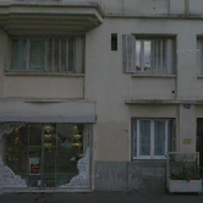
    </td>

</tr>


</table>


### If you find this code would be useful
Please cite our paper

```
@InProceedings{Xie_2019_ICCV,
author = {Xie, Chaohao and Liu, Shaohui and Li, Chao and Cheng, Ming-Ming and Zuo, Wangmeng and Liu, Xiao and Wen, Shilei and Ding, Errui},
title = {Image Inpainting With Learnable Bidirectional Attention Maps},
booktitle = {The IEEE International Conference on Computer Vision (ICCV)},
month = {October},
year = {2019}
}
```


### Acknowledgement
We benifit a lot from [NVIDIA-partialconv](https://github.com/NVIDIA/partialconv) and [naoto0804-pytorch-inpainting-with-partial-conv](https://github.com/naoto0804/pytorch-inpainting-with-partial-conv
), thanks for their excellent work.
